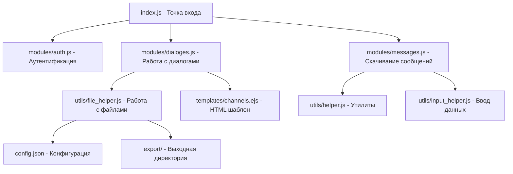
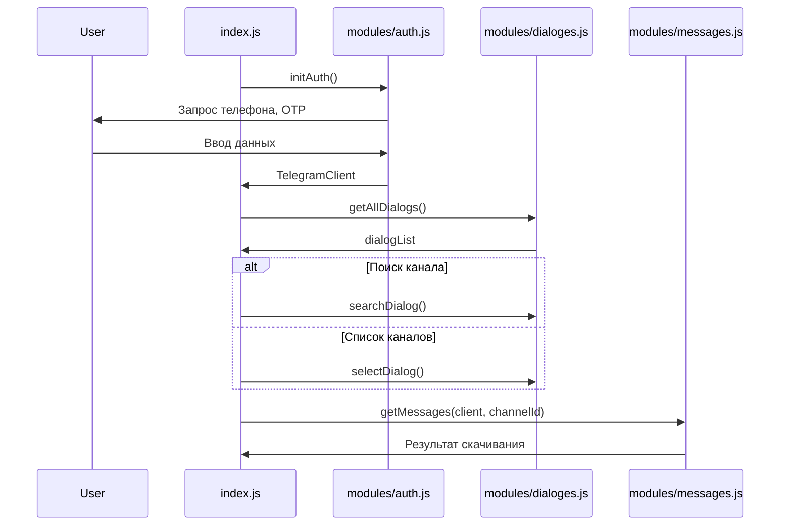

# Telegram Channel Downloader - Архитектурный анализ

## Общая информация

**Назначение:** CLI-инструмент для скачивания медиафайлов и сообщений из Telegram каналов, групп и диалогов пользователей с сохранением в HTML/JSON форматы.

**Стек технологий:**
- Node.js (JavaScript)
- Telegram MTProto API (библиотека `telegram`)
- EJS (шаблонизация для HTML)
- Inquirer (интерактивный CLI)

---

## Архитектура приложения



---

## Структура проекта

```
├── index.js                    # Главный файл (точка входа)
├── package.json                # Зависимости npm
├── config.json                 # Конфигурация (API ключи, сессия) - не в репозитории
├── modules/
│   ├── auth.js                 # Аутентификация в Telegram
│   ├── dialoges.js             # Получение и выбор диалогов
│   └── messages.js             # Скачивание сообщений и медиа
├── utils/
│   ├── helper.js               # Утилиты: логирование, определение типа медиа, пути к файлам
│   ├── file_helper.js          # Чтение/запись config.json и last_selection.json
│   └── input_helper.js         # Интерактивный ввод (inquirer)
├── templates/
│   └── channels.ejs            # EJS шаблон для HTML списка контактов
└── export/                     # Выходная директория (gitignored)
    ├── dialog_list.html        # Список контактов в HTML
    ├── dialog_list.json       # Список контактов в JSON
    ├── raw_dialog_list.json   # Сырые данные диалогов
    ├── last_selection.json     # Последний выбранный канал
    └── {channelId}/
        ├── raw_message.json    # Сырые сообщения
        ├── all_message.json    # Обработанные сообщения
        ├── image/              # Скачанные изображения
        ├── video/              # Скачанные видео
        ├── audio/              # Скачанные аудио
        └── document/           # Скачанные документы
```

---

## Анализ модулей

### 1. [`index.js`](index.js) - Главный файл

**Функции:**
- Инициализация аутентификации
- Получение списка диалогов
- Выбор канала (поиск или список)
- Запуск скачивания сообщений

**Поток выполнения:**


---

### 2. [`modules/auth.js`](modules/auth.js) - Аутентификация

**Ответственность:**
- Создание TelegramClient с MTProto
- Аутентификация по номеру телефона
- Сохранение сессии в config.json

**Особенности:**
- Маскировка под Telegram Desktop (deviceModel, appVersion)
- Поддержка flood wait (автоматические повторные попытки)
- Выбор метода OTP (SMS или приложение)

---

### 3. [`modules/dialoges.js`](modules/dialoges.js) - Работа с диалогами

**Функции:**
- [`getAllDialogs()`](modules/dialoges.js:8) - получение всех диалогов
- [`selectDialog()`](modules/dialoges.js:68) - выбор из списка
- [`searchDialog()`](modules/dialoges.js:75) - поиск по имени
- [`getDialogName()`](modules/dialoges.js:94) - получение имени по ID

**Экспорт:**
```javascript
module.exports = {
    getAllDialogs,
    selectDialog,
    searchDialog,
    getDialogName
}
```

---

### 4. [`modules/messages.js`](modules/messages.js) - Скачивание сообщений (САМЫЙ СЛОЖНЫЙ МОДУЛЬ)

**Главная функция:** [`getMessages()`](modules/messages.js:273)

**Ключевые возможности:**
- Параллельное скачивание (до 20 файлов одновременно)
- Flood control (защита от rate limiting Telegram)
- Пропуск уже скачанных файлов
- Прогресс-бар с расчётом ETA
- Текстовые фильтры (отключены, но код оставлен)
- Быстрая перемотка (fast forward) до последней позиции

**Константы:**
```javascript
MAX_PARALLEL_DOWNLOAD = 20
MESSAGE_LIMIT = 200
BASE_RPC_DELAY_SECONDS = 0.15
MAX_RPC_RETRIES = 5
PROGRESS_LOG_INTERVAL_SECONDS = 5
FAST_FORWARD_MESSAGE_LIMIT = 1000
```

**Экспорт:**
```javascript
module.exports = {
    getMessages,       // Основная функция скачивания
    getMessageDetail,  // Скачивание конкретных сообщений
    sendMessage        // Отправка сообщений (не используется)
}
```

---

### 5. [`utils/helper.js`](utils/helper.js) - Утилиты

**Константы:**
```javascript
MEDIA_TYPES = {
    IMAGE, VIDEO, AUDIO, WEBPAGE, POLL, GEO, VENUE, CONTACT, STICKER, DOCUMENT, OTHERS
}
```

**Функции:**
| Функция | Назначение |
|---------|------------|
| [`getMediaType()`](utils/helper.js:40) | Определение типа медиа по message |
| [`checkFileExist()`](utils/helper.js:75) | Проверка существования файла |
| [`getMediaPath()`](utils/helper.js:122) | Генерация пути для сохранения |
| [`logMessage`](utils/helper.js:183) | Логирование с цветами (info, error, success, debug) |
| [`wait()`](utils/helper.js:206) | Асинхронная задержка |
| [`circularStringify()`](utils/helper.js:219) | JSON.stringify с защитой от циклических ссылок |
| [`appendToJSONArrayFile()`](utils/helper.js:235) | Добавление данных в JSON массив |

---

### 6. [`utils/file_helper.js`](utils/file_helper.js) - Файловая система

**Функции:**
| Функция | Назначение |
|---------|------------|
| [`getCredentials()`](utils/file_helper.js:20) | Чтение config.json |
| [`updateCredentials()`](utils/file_helper.js:7) | Запись в config.json |
| [`getLastSelection()`](utils/file_helper.js:33) | Чтение last_selection.json |
| [`updateLastSelection()`](utils/file_helper.js:44) | Запись в last_selection.json |

---

### 7. [`utils/input_helper.js`](utils/input_helper.js) - Интерактивный ввод

**Функции:** Все используют библиотеку `inquirer`

| Функция | Тип ввода |
|---------|-----------|
| [`mobileNumberInput()`](utils/input_helper.js:4) | Телефон (+формат) |
| [`optInput()`](utils/input_helper.js:24) | OTP код (5-6 цифр) |
| [`textInput()`](utils/input_helper.js:43) | Произвольный текст |
| [`numberInput()`](utils/input_helper.js:53) | Число с валидацией |
| [`booleanInput()`](utils/input_helper.js:79) | Да/Нет |
| [`selectInput()`](utils/input_helper.js:94) | Выбор из списка |
| [`multipleChoice()`](utils/input_helper.js:106) | Множественный выбор (checkbox) |
| [`downloadOptionInput()`](utils/input_helper.js:123) | Выбор типов файлов для скачивания |

---

## Сильные стороны проекта

1. **Flood Control** - продуманная система защиты от rate limiting с адаптивным параллелизмом
2. **Устойчивость к перезапускам** - сохранение позиции скачивания в `last_selection.json`
3. **Гибкая система типов файлов** - можно выбрать что скач��вать, поддержка кастомных расширений
4. **Пропуск существующих файлов** - не перекачивает уже скачанное
5. **Прогресс-бар** - показывает ETA и скорость с учётом скользящего окна
6. **HTML-экспорт** - удобный просмотр списка контактов

---

## Слабые стороны и проблемы

### Критические

1. **Нет обработки ошибок в [`appendToJSONArrayFile()`](utils/helper.js:235)** - используется `fs.readFile` с callback, что может привести к проблемам при одновременной записи
2. **Глобальные переменные** - `channelId` и `client` в index.js используются без надлежащей инкапсуляции
3. **Нет TypeScript** - отсутствие типизации затрудняет рефакторинг
4. **Устаревшие зависимости** - `telegram: ^2.26.22` от 2022 года

### Средние

5. **Дублирование кода** - [`logDownloadProgress()`](modules/messages.js:53) дублируется в [`getMessageDetail()`](modules/messages.js:585)
6. **Модуль `sendMessage()`** - экспортируется, но не используется
7. **Странные русские слова в [`exclude`](modules/messages.js:454) фильтре** - "прямойэфир", "рыночныйфон" - возможно, остатки отладки
8. **Magic strings** - повторяющиеся строки типа `"file_"`, `"raw_message.json"`

### Низкие

9. **Нет unit-тестов**
10. **EJS шаблон** - захардкоженные emoji в template, лучше вынести в конфигурацию
11. **npm/yarn lock** - есть оба файла, нужно выбрать один

---

## Паттерны и анти-паттерны

### Используемые паттерны
- **Module Pattern** - разделение ответственности по файлам
- **Async/Await** - современный асинхронный код
- **IIFE** - `(async () => {...})()` в index.js
- **Fluent interface** - цепочки методов в `updateLastSelection`

### Анти-паттерны
- **Callback Hell** - в `appendToJSONArrayFile` (fs.readFile с callback)
- **Глобальное состояние** - переменные `channelId`, `client`
- **Magic numbers** - `MESSAGE_LIMIT = 200`, `MAX_PARALLEL_DOWNLOAD = 20`
- **Side effects** - файловые операции внутри утилит

---

## Зависимости (package.json)

| Зависимость | Версия | Назначение |
|------------|--------|------------|
| telegram | ^2.26.22 | MTProto API клиент |
| inquirer | ^8.2.6 | Интерактивный CLI |
| ejs | ^3.1.10 | Шаблонизатор |
| mime-db | ^1.52.0 | Определение MIME типа |

---

## Рекомендации по улучшению

### Высокий приоритет

1. **Добавить TypeScript** - переписать ключевые модули
2. **Исправить appendToJSONArrayFile** - использовать fs.promises или async/await
3. **Вынести константы в config.json** - `MAX_PARALLEL_DOWNLOAD`, `MESSAGE_LIMIT` и т.д.
4. **Добавить логирование в файл** - помимо консоли

### Средний приоритет

5. **Рефакторинг logDownloadProgress** - вынести в отдельный модуль
6. **Добавить unit-тесты** - минимум для helper.js функций
7. **Очистить фильтры** - убрать мусорные русские слова или сделать настраиваемыми
8. **Обновить зависимости** - проверить最新 версии библиотек

### Низкий приоритет

9. **CLI прогресс-бар** - использовать библиотеку `cli-progress`
10. **配置文件** - добавить .editorconfig
11. **CI/CD** - GitHub Actions для автоматических тестов
12. **Docker** - контейнеризация для изоляции

---

## Потенциальные направления развития

1. **Веб-интерфейс** - добавить Express сервер для управления
2. **Webhook уведомления** - оповещение о завершении скачивания
3. **Фильтрация по дате** - скачивать только за период
4. **Облачное хранилище** - интеграция с S3/Google Drive
5. **Планировщик** - автоскачивание по расписанию
