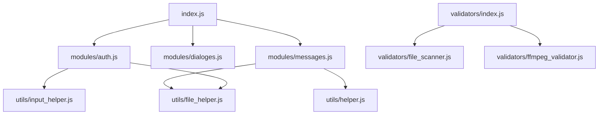

# Документация проекта Telegram Channel Downloader

## Обзор
**Telegram Channel Downloader** — это Node.js приложение для автоматизированного скачивания сообщений и медиафайлов из Telegram каналов, групп и личных чатов. Проект использует библиотеку `gramjs` (пакет `telegram`) для взаимодействия с Telegram API.

## Архитектура системы

### Основные компоненты
1.  **Точка входа (`index.js`)**: Управляет жизненным циклом приложения, инициализирует аутентификацию и запускает процесс скачивания или валидации.
2.  **Модули (`modules/`)**:
    *   [`auth.js`](modules/auth.js): Логика авторизации, обработка OTP и управление сессиями.
    *   [`dialoges.js`](modules/dialoges.js): Работа со списком чатов (поиск, выбор, экспорт списка).
    *   [`messages.js`](modules/messages.js): Основное ядро скачивания сообщений и медиа, управление очередью загрузок и обход ограничений (Flood Wait).
3.  **Утилиты (`utils/`)**:
    *   [`helper.js`](utils/helper.js): Общие функции (логирование, работа с JSON Lines, определение типов медиа).
    *   [`file_helper.js`](utils/file_helper.js): Работа с конфигурацией (`config.json`) и состоянием (`last_selection.json`).
    *   [`input_helper.js`](utils/input_helper.js): Обертки над `inquirer` для интерактивного ввода.
    *   [`migration.js`](utils/migration.js): Скрипты для миграции данных в формат JSON Lines и дедупликации.
4.  **Валидаторы (`validators/`)**:
    *   [`index.js`](validators/index.js): CLI интерфейс для проверки целостности скачанных файлов.
    *   [`ffmpeg_validator.js`](validators/ffmpeg_validator.js): Интеграция с FFmpeg для глубокой проверки изображений и видео.
    *   [`file_scanner.js`](validators/file_scanner.js): Рекурсивный поиск медиафайлов в директории экспорта.

### Схема взаимодействия


## Процессы

### 1. Аутентификация
Пр��ложение поддерживает вход по номеру телефона с использованием OTP (через приложение Telegram или SMS). Сессия сохраняется в `config.json` в виде `sessionId` (StringSession), что позволяет избегать повторного ввода кода. Реализована защита от Flood Wait при авторизации.

### 2. Скачивание сообщений и медиа
*   **Пакетная обработка**: Сообщения запрашиваются пачками (по умолчанию 200 штук).
*   **Параллельная загрузка**: Медиафайлы скачиваются параллельно с использованием динамически регулируемого лимита (по умолчанию до 20 потоков).
*   **Flood Control**: Система автоматически снижает количество параллельных загрузок и делает паузы при получении ошибок `FLOOD_WAIT` от Telegram API.
*   **Кэширование**: Перед скачиванием проверяется наличие файла на диске и его размер, чтобы избежать повторных загрузок.

### 3. Валидация файлов
Инструмент валидации позволяет:
*   Сканировать папку `export/` на наличие поврежденных файлов.
*   Использовать FFmpeg для проверки того, что видео и изображения открываются корректно.
*   Автоматически удалять битые файлы (режим `--dry-run` позволяет только просмотреть список).

## Форматы данных

### SQLite (основное хранилище)
Начиная с версии 2.0, сообщения хранятся в **SQLite** базе данных для оптимизации производительности и уменьшения размера файлов.
*   Файл базы данных: `export/{channel_id}/messages.db`
*   Использует библиотеку `better-sqlite3` с WAL режимом для высокой производительности
*   Транзакционная запись обеспечивает целостность данных

**Преимущества SQLite:**
*   Бинарный формат — значительно меньший размер по сравнению с JSON
*   Индексация по ID и дате — мгновенный поиск
*   Не раздувается при записи — нет проблемы "гигантских файлов"
*   Потребляет меньше памяти при обработке

### JSON Lines (экспорт)
JSON файлы по-прежнему доступны для экспорта из SQLite:
*   `raw_message.json`: Полные данные от Telegram API.
*   `all_message.json`: Упрощенная структура для быстрого доступа.

**Формат JSON Lines:**
*   Каждая строка файла является валидным JSON-объектом.
*   Дозапись в конец файла за O(1).
*   Устойчивость к повреждению файла (битая строка не портит весь файл).

### Структура экспорта
```text
export/
├── [channel_id]/
│   ├── messages.db          # SQLite база данных (основное хранилище)
│   ├── all_message.json     # Экспорт (создается командой npm run export-messages)
│   ├── raw_message.json     # Экспорт (создается командой npm run export-messages)
│   ├── image/
│   ├── video/
│   ├── audio/
│   └── ... (другие типы медиа)
├── dialog_list.json
├── dialog_list.html
└── last_selection.json
```

## Настройка и запуск
1.  Создать `config.json` с `apiId` и `apiHash`.
2.  `npm install` — установка зависимостей (включает `better-sqlite3`).
3.  `npm start` — запуск основного процесса (скачивание в SQLite).
4.  `npm run valid` — запуск валидатора.
5.  `npm run migrate` — конвертация старых JSON-файлов в формат JSON Lines.
6.  `npm run migrate-json-to-db` — миграция существующих JSON файлов в SQLite.
7.  `npm run export-messages` — экспорт данных из SQLite обратно в JSON файлы.

## Технологический стек
*   **Runtime**: Node.js
*   **API**: GramJS (Telegram)
*   **UI**: Inquirer (CLI), EJS (HTML Export)
*   **Validation**: FFmpeg / FFprobe
