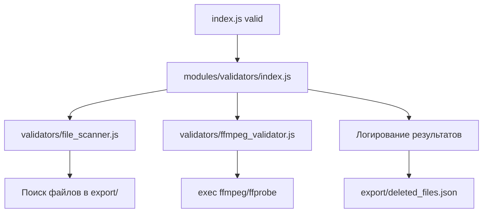

# Telegram Channel Downloader - Модуль валидации файлов

## Назначение

Модуль для проверки целостности медиафайлов (изображений и видео) в директории `export/`. Использует `ffmpeg` для валидации - если файл не может быть открыт/прочитан ffmpeg, он считается битым и подлежит удалению.

## Запуск

```bash
npm run start valid        # Запуск с удалением битых файлов
npm run start valid -- --dry-run  # Тестовый режим (без удаления)
```

## Структура директории export

```
export/
├── last_selection.json
├── {channelId}/
│   ├── raw_message.json
│   ├── all_message.json
│   ├── image/          # .jpg, .jpeg, .png, .gif, .webp
│   ├── video/          # .mp4, .avi, .mkv, .mov
│   ├── audio/          # .mp3, .ogg, .wav
│   └── document/       # прочие файлы
├── {channelId2}/
│   └── ...
```

## Поддерживаемые типы файлов

| Тип | Расширения | Валидация через ffmpeg |
|-----|------------|------------------------|
| Изображения | jpg, jpeg, png, gif, webp, bmp, tiff | Да (ffmpeg -i) |
| Видео | mp4, avi, mkv, mov, webm, flv | Да (ffprobe) |

## Архитектура модуля



## Компоненты

### 1. `modules/validators/index.js` - Точка входа валидатора

**Функции:**
- `runValidation(options)` - главная функция
- `getDeletedFilesLogPath()` - путь к логу удалений

**Опции:**
```javascript
{
  dryRun: boolean,     // true = только лог, без удаления
  verbose: boolean,   // детальный вывод
  extensions: string[] // фильтр по расширениям
}
```

### 2. `validators/file_scanner.js` - Сканирование файлов

**Функции:**
- `scanExportDirectory(exportPath)` - рекурсивный поиск всех файлов
- `getMediaFiles(files)` - фильтрация только медиафайлов
- `getImageExtensions()` - список поддерживаемых изображений
- `getVideoExtensions()` - список поддерживаемых видео

**Алгоритм:**
1. Рекурсивно обходит `export/{channelId}/`
2. Пропускает `.json` файлы
3. Возвращает массив `{ path, relativePath, extension, size }`

### 3. `validators/ffmpeg_validator.js` - Валидация через ffmpeg

**Функции:**
- `validateFile(filePath)` - проверка одного файла
- `validateFiles(files, options, progressCallback)` - массовая проверка

**Алгоритм валидации:**

Для **изо��ражений** (ffmpeg):
```bash
ffmpeg -v error -i input.jpg -f null -
```
- exit code = 0 → файл валидный
- exit code ≠ 0 → файл битый/неполный

Для **видео** (ffprobe):
```bash
ffprobe -v error -show_entries format=duration -of default=noprint_wrappers=1:nokey=1 input.mp4
```
- exit code = 0, есть duration → файл валидный
- иначе → файл битый/неполный

**Параллелизм:** до 10 параллельных проверок (во избежание перегрузки)

### 4. Формат лога `export/deleted_files.json`

```json
{
  "timestamp": "2024-01-15T10:30:00.000Z",
  "dryRun": false,
  "totalScanned": 1500,
  "totalInvalid": 12,
  "deleted": [
    {
      "path": "123456/image/file_789.jpg",
      "size": 102400,
      "reason": "ffmpeg: Invalid image format",
      "timestamp": "2024-01-15T10:30:05.000Z"
    }
  ],
  "errors": [
    {
      "path": "123456/video/file_101.mp4",
      "error": "ffprobe timeout"
    }
  ]
}
```

## Псевдокод алгоритма

```
ФУНКЦИЯ runValidation(options):
    создать results = { deleted: [], errors: [], scanned: 0, invalid: 0 }
    
    files = scanExportDirectory("export/")
    медиаФайлы = files.filter(расширение ∈ [изображения, видео])
    
    ДЛЯ КАЖДОГО файла медиаФайлы С ПАРАЛЛЕЛИЗМОМ(10):
        показать прогресс
        
        валиден = ffmpeg_validate(файл.path)
        
        ЕСЛИ валиден:
            continue
        ИНАЧЕ:
            results.invalid += 1
            
            ЕСЛИ options.dryRun:
                вывести в лог "DRY-RUN: Would delete {файл.path}"
            ИНАЧЕ:
                удалить_файл(файл.path)
                добавить в results.deleted
                вывести в лог "DELETED: {файл.path}"
    
    сохранить_лог("export/deleted_files.json", results)
    вывести статистику
```

## Обработка ошибок

| Ситуация | Поведение |
|----------|----------|
| ffmpeg не установлен | Критическая ошибка, выход с кодом 1 |
| Файл не существует | Пропуск с предупреждением |
| Таймаут валидации (30 сек) | Записать в errors, считать битым |
| Нет прав на удаление | Записать в errors, продолжить |
| Директория export пуста | Информационное сообщение |

## Зависимости

- `ffmpeg` - должен быть установлен в системе (проверка через `which ffmpeg`)
- Стандартные Node.js: `fs`, `path`, `child_process`, `readline`

## Метрики и статистика

После завершения выводится:
```
=== Validation Complete ===
Scanned: 1500 files
Valid: 1488 files
Invalid: 12 files
Deleted: 12 files (0 in dry-run mode)
Errors: 0
Duration: 45.2s
```

## Планы по расширению

1. Добавить проверку хэша файла (MD5/SHA256) если доступен оригинал
2. Интеграция с Telegram API для перекачивания битых файлов
3. Webhook уведомление о найденных битых файлах
4. Автоматическая валидация после каждого сеанса скачивания
