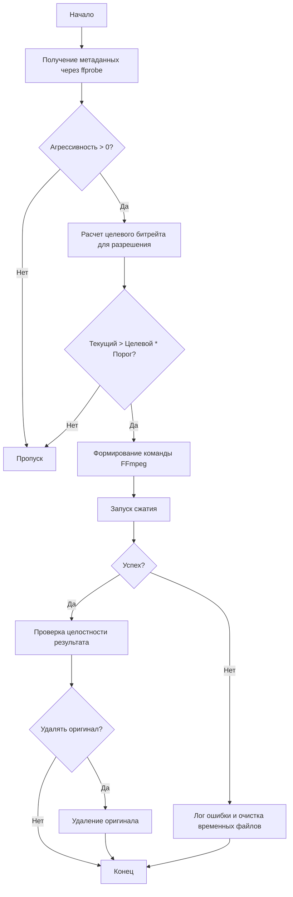

# Проектирование модуля сжатия видео (FFmpeg Compressor)

Этот модуль предназначен для автоматического принятия решения о сжатии видеофайлов на основе их технических характеристик (битрейт, разрешение) и заданного уровня агрессивности.

## 1. Логика принятия решения

Модуль анализирует видео и решает, нужно ли его сжимать, используя следующую формулу:

`Нужно_сжимать = Текущий_битрейт > (Целевой_битрейт * Порог_чувствительности)`

### Целевые битрейты (базовые для H.264):
- **480p и ниже:** 1.5 Mbps
- **720p (HD):** 3.5 Mbps
- **1080p (Full HD):** 7.0 Mbps
- **1440p (2K):** 12.0 Mbps
- **2160p (4K):** 25.0 Mbps

### Порог чувствительности:
Зависит от агрессивности. Чем выше агрессивность, тем ниже порог (тем чаще будем сжимать).
`Порог = 1.5 - (Агрессивность / 20)` (при агрессивности 2 порог = 1.4, при 10 порог = 1.0).

## 2. Маппинг агрессивности (0-10)

Агрессивность влияет на параметры FFmpeg: `CRF` (качество) и `preset` (скорость/эффективность).

| Уровень | CRF (H.264) | Preset | Описание |
| :--- | :--- | :--- | :--- |
| 0 | - | - | Пропуск (без сжатия) |
| 1-2 | 20-22 | fast | Высокое качество, быстрое сжатие |
| 3-5 | 23-26 | medium | Баланс (стандарт) |
| 6-8 | 27-30 | slow | Сильное сжатие, долгая обработка |
| 9-10 | 31-35 | veryslow | Максимальное сжатие, очень долгая обработка |

*Формула CRF: `CRF = 18 + (Агрессивность * 1.7)`*

## 3. Структура модуля

### Входные аргументы (API):
- `inputPath` (string): Путь к исходному файлу.
- `options` (object):
    - `output` (string): Директория вывода (по умолчанию папка файла).
    - `aggressiveness` (number): 0-10 (по умолчанию 2).
    - `deleteOriginal` (boolean): Удалять ли оригинал после успеха (по умолчанию false).
    - `onProgress` (function): Callback для отслеживания прогресса.

### Зависимости:
- `ffmpeg` и `ffprobe` (через `validators/ffmpeg_validator.js`).
- `child_process` для запуска команд.

## 4. Алгоритм работы (Mermaid)

## 5. Дополнительные возможности (на усмотрение)
1. **Аппаратное ускорение:** Автоматическое использование `h264_nvenc` (Nvidia) или `h264_amf` (AMD), если доступно.
2. **Обработка аудио:** Если битрейт аудио > 192kbps, сжимать до 128kbps (AAC).
3. **Суффикс файлов:** Добавление `_compressed` к имени, если `output` совпадает с входной директорией.
